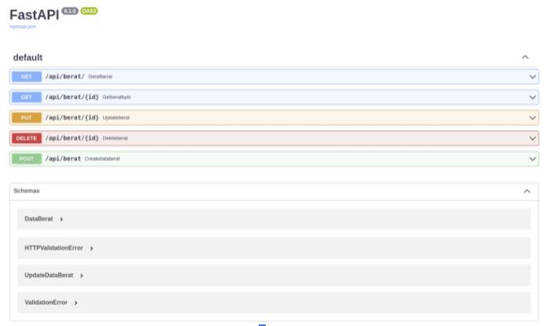
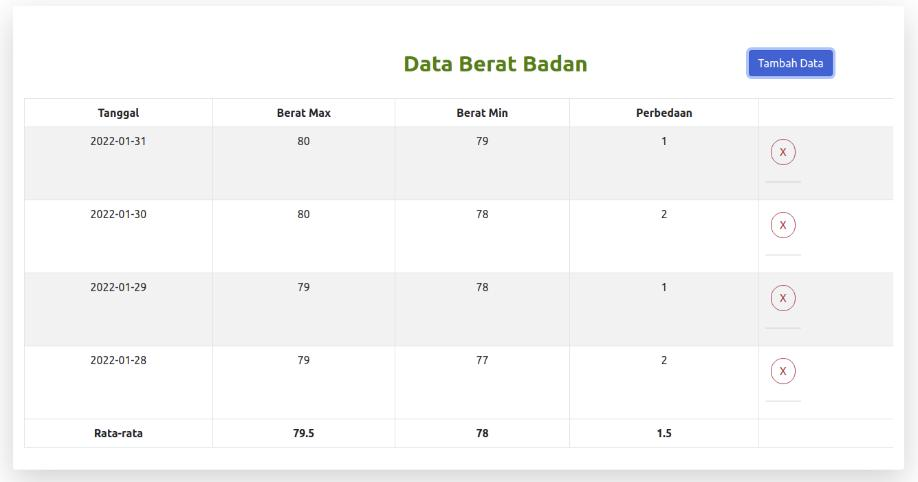

# BE - BERAT

a CRUD program run by Python FastAPI back-end and ReactJs as front-end. The connection served by REST protocol between back-end and  database , also axios to communicate into front-end. The database tested with MongoDB with NoSQL schema, and the database run on docker container. 

##### Base Requirements:

1. fastapi
2. python environment (miniconda)
3. reactjs
4. docker image for MongoDB

##### Installation step:

1.  pull mongodb docker image

   `docker pull mongo`

2. install conda (miniconda environment) and the requirements

   conda command for new environment and install dependencies

   `conda create -n program python=3.7`

   `conda activate program`

   `pip install backend/requirements.txt`

3. install ReactJs with the dependencies

   `npm install create-react-apps`

   change to front-end directory then run the dependencies

   `npm install axios react-bootstrap moment --save`

##### Run the program

1. Run docker container for MondoDB and expose port to 5000

   `docker run --name mongo -p 5000:27017 mongo:latest`

2. Run the shell file `run.sh` which contain command to run both back-end and front-end program.

3. Check documentation of back-end API by SwaggerUI on web browser via`http://localhost:8001/docs` 

   

4. Check the running program on web browser by front-end on `http://localhost:3000`

   

##### Drawback

To be honest I'm having difficult on passing the update methods to the front-end due to my lack of front-end knowledge. So it become and issue for my own development hustle.

- [ ] update methods on front-end
- [ ] view by item id on front-end